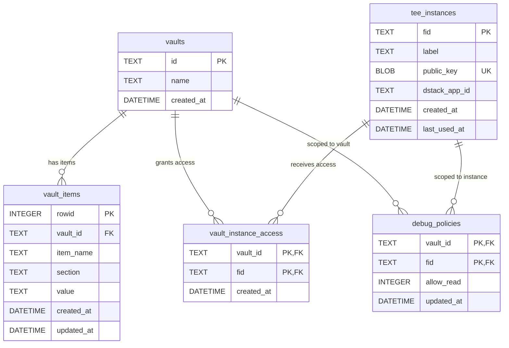

# Database Schema

Jingui uses SQLite with WAL mode and foreign key enforcement. The schema is vault-centric: secrets are organized into vaults, and TEE instances are granted access to vaults through a many-to-many junction table.

## ER Diagram



## Table Definitions

### `vaults`

Top-level container for secrets.

| Column | Type | Constraints |
|--------|------|-------------|
| `id` | TEXT | PRIMARY KEY |
| `name` | TEXT | NOT NULL |
| `created_at` | DATETIME | NOT NULL, DEFAULT CURRENT_TIMESTAMP |

### `vault_items`

Individual key-value fields stored within a vault, grouped by section.

| Column | Type | Constraints |
|--------|------|-------------|
| `rowid` | INTEGER | PRIMARY KEY AUTOINCREMENT |
| `vault_id` | TEXT | NOT NULL, FK → `vaults(id)` |
| `item_name` | TEXT | NOT NULL |
| `section` | TEXT | NOT NULL, DEFAULT `''` |
| `value` | TEXT | NOT NULL, DEFAULT `''` |
| `created_at` | DATETIME | NOT NULL, DEFAULT CURRENT_TIMESTAMP |
| `updated_at` | DATETIME | NOT NULL, DEFAULT CURRENT_TIMESTAMP |

**Unique constraint:** `(vault_id, section, item_name)`

### `tee_instances`

Registered TEE instances identified by their X25519 public key fingerprint.

| Column | Type | Constraints |
|--------|------|-------------|
| `fid` | TEXT | PRIMARY KEY — `hex(SHA1(public_key))`, 40 hex chars |
| `label` | TEXT | NOT NULL, DEFAULT `''` |
| `public_key` | BLOB | NOT NULL, UNIQUE — 32-byte X25519 public key |
| `dstack_app_id` | TEXT | NOT NULL — dstack attestation chain app identity |
| `created_at` | DATETIME | NOT NULL, DEFAULT CURRENT_TIMESTAMP |
| `last_used_at` | DATETIME | nullable, updated on each secret fetch |

### `vault_instance_access`

Junction table granting TEE instances access to vaults (many-to-many).

| Column | Type | Constraints |
|--------|------|-------------|
| `vault_id` | TEXT | NOT NULL, FK → `vaults(id)` |
| `fid` | TEXT | NOT NULL, FK → `tee_instances(fid)` |
| `created_at` | DATETIME | NOT NULL, DEFAULT CURRENT_TIMESTAMP |

**Primary key:** `(vault_id, fid)`

### `debug_policies`

Per vault+instance debug-read policy. Controls whether `jingui read` is allowed.

| Column | Type | Constraints |
|--------|------|-------------|
| `vault_id` | TEXT | NOT NULL, FK → `vaults(id)` |
| `fid` | TEXT | NOT NULL, FK → `tee_instances(fid)` |
| `allow_read` | INTEGER | NOT NULL, DEFAULT 1 (true) |
| `updated_at` | DATETIME | NOT NULL, DEFAULT CURRENT_TIMESTAMP |

**Primary key:** `(vault_id, fid)`

## Relationship Semantics

- **vault → vault_items** (1:N): A vault contains many items. Deleting a vault with `?cascade=true` deletes all its items and access grants.
- **vault ↔ tee_instances** (M:N via `vault_instance_access`): An instance can access multiple vaults, and a vault can be accessed by multiple instances. Grants are managed explicitly via the admin API.
- **debug_policies** (per vault+instance pair): Optional override of the default allow-read policy. When no row exists, `allow_read` defaults to `true`.

## Secret Reference → DB Mapping

A `jingui://` (or `op://`) URI maps to the database as follows:

```
jingui://<vault>/<item>/<field>

  vault_id  = <vault>     (vaults.id)
  section   = <item>      (vault_items.section)
  item_name = <field>     (vault_items.item_name)
```

For 4-segment references (`jingui://<vault>/<item>/<section>/<field>`), the parser extracts `Item=<item>`, `Section=<section>`, `FieldName=<field>`. The fetch handler maps `dbSection = ref.Item` and `dbItemName = ref.FieldName` — the URI section segment is metadata, not used in the DB lookup.

**Example:**

| URI | vault_id | section (DB) | item_name (DB) |
|-----|----------|-------------|----------------|
| `jingui://my-gmail/alice/client_id` | `my-gmail` | `alice` | `client_id` |
| `jingui://my-gmail/alice/oauth/token` | `my-gmail` | `alice` | `token` |

Source: `internal/server/handler/secrets.go:318-323`

## Access Control Model

During `POST /v1/secrets/fetch`, for each secret reference:

1. Parse the reference URI to extract `vault`, `item`, `field`.
2. Look up the `vault_instance_access` junction table: `HasVaultAccess(vault_id, fid)`.
3. If the request carries `X-Jingui-Command: read`, also check `debug_policies` for the vault+instance pair. If `allow_read = false`, the request is denied.
4. Retrieve the field value from `vault_items` and ECIES-encrypt it to the instance's public key.
